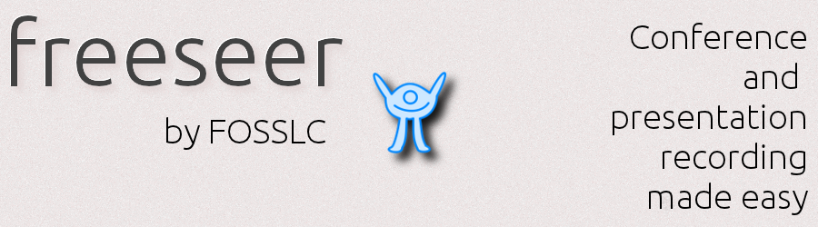

## Freeseer Website

Freeseer is a free and open source screencasting application.
Its primary purpose is capturing or streaming video at conferences.

This repository is dedicated for our online user-facing [documentation](http://freeseer.github.io).
